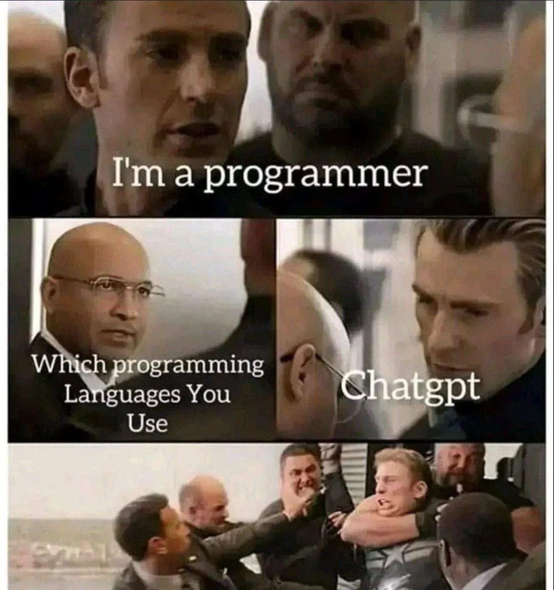
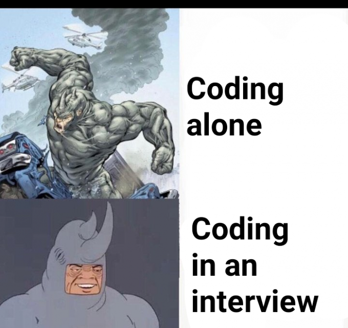
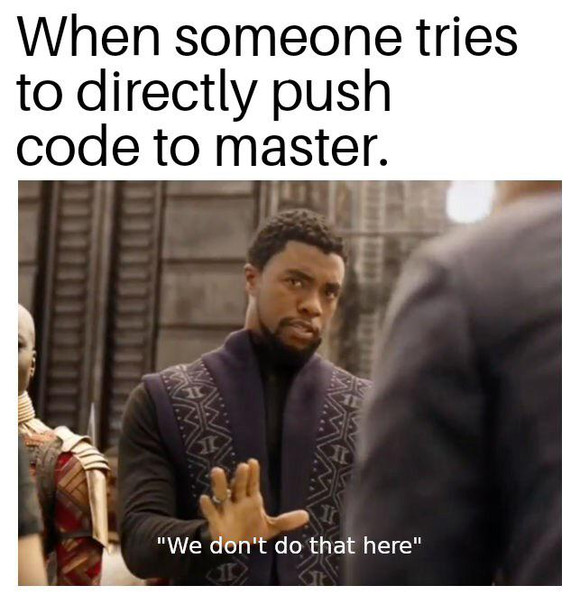
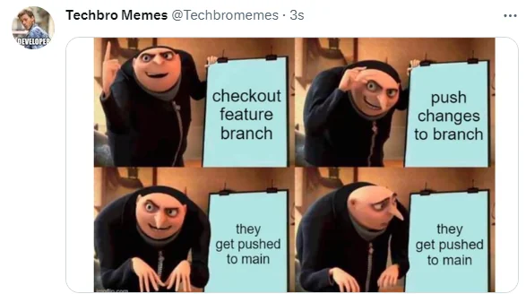
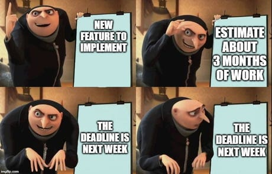

# Hi, Carlos Nina here.

## &nbsp;**_About me_**

I am a Systems Engineering student at UCB, Bolivia. I am passionate about learning and building innovative and creative solutions using various technologies.

- **I am interested in Web Development, and DevOps**

* 🌱 I’m currently learning:
  - Keycloak
  - Spring Boot Microservices
* Outside tech, 📖 I love to read books on business, entrepreneurship, marketing, philosophy, human behavior, and psychology. I also practice calisthenics and am working on a personal project on social media.
* 📫 Reach out to me at: <a href="mailto:cninareynaga@gmail.com">Email</a>

## &nbsp;**_Skills_**

### Frontend

  

### Backend

  

### DevOps

  

## 👀 My GitHub Stats

  
  

**Dont forget to check out my GitHub repositories:**

  

    
    
  

## Contact Me

  
  
    
    

## A real developer without memes is not a developer

                
                
                
                
                
                

