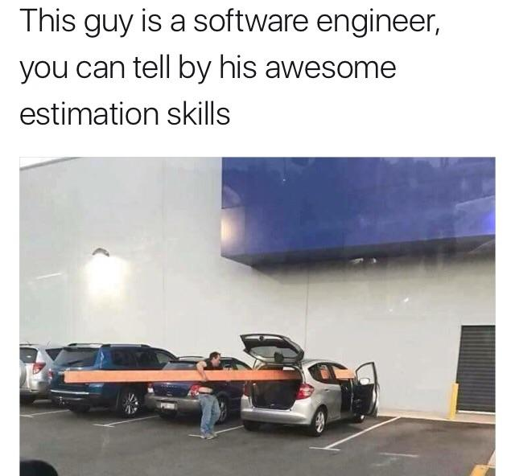

# Hi, Carlos Nina here.

##  **_About me_**

I am a Full Stack developer passionate about Vue.js, React, and Spring Boot. I have developed several significant projects for the Bolivian Catholic University (UCB), focusing on innovative systems that enhance academic and administrative efficiency. I love solving complex problems and am dedicated to continuous learning and professional growth.

I have experience with JWT + RBAC, security, session management, API consumption, clean architecture, and the complete software development lifecycle.

- **I am interested in Full Stack Web Development**

* 🌱 I’m currently learning:
  - Frontend development state management libraries

Feel free to explore my repositories to see my projects and contributions.

- 📫 Reach out to me at: <a href="mailto:cninareynaga@gmail.com">Email</a>

## &nbsp;**_Skills_**

### Frontend

  

### Backend

  

### DevOps

  

## 👀 My GitHub Stats

  
  

**Dont forget to check out my GitHub repositories:**

  

    
    
    
    
  

## Contact Me

  
  
    
    

## Some memes:

  
Click to expand

                
                
                
                
                
                

